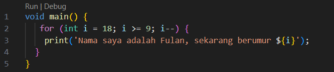
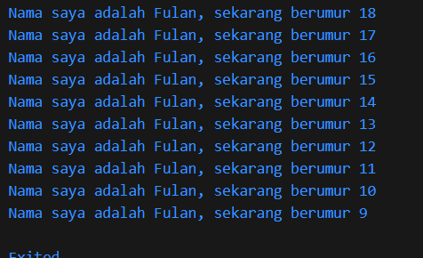

## Soal No. 1

Output:

## Soal No. 2
> Mengapa sangat penting untuk memahami bahasa pemrograman Dart sebelum kita menggunakan framework Flutter ? Jelaskan!

Kita perlu memahami bahasa pemrograman Dart terlebih dahulu karena FLutter adalah SDK untuk mengembangkan aplikasi berbagai platform yang menggunakan bahasa pemrograman Dart. Dengan memahami sintaks Dart, kita akan lebih mudah menulis kode Flutter yang efisien dan terstruktur dengan baik.

## Soal No. 3
> Rangkumlah materi dari codelab ini menjadi poin-poin penting yang dapat Anda gunakan untuk membantu proses pengembangan aplikasi mobile menggunakan framework Flutter.

* Dapat digunakan untuk compile ke berbagai platform.
* Menggunakan Just-In-Time Compilation sehingga memudahkan developer untuk melakukan perubahan.
* Kode program berjalan pada memori terisolasi yang memungkinkan untuk melakukan pekerjaan secara asynchronous pada background.
* Mempunyai fitur Null Safety yang menjadikan sebuah object tidak dapat memiliki nilai null kecuali jika developer memperbolehkannya.
* Memiliki fitu Safe Type yang memungkinkan untuk pengecekan variable yang tidak terpakai agar lebih hemat memory.