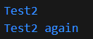
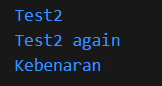

# Praktikum 1 - Menerapkan Control Flows ("if/else")
## Langkah 1
Ketik atau salin kode program berikut ke dalam fungsi ```main()```.
```String test = "test2";
if (test == "test1") {
   print("Test1");
} else If (test == "test2") {
   print("Test2");
} Else {
   print("Something else");
}

if (test == "test2") print("Test2 again");
```
## Langkah 2
Silakan coba eksekusi (Run) kode pada langkah 1 tersebut. Apa yang terjadi? Jelaskan!

> Akan terjadi error. Hal ini dikarenakan Dart bersifat case-sensitive, jadi huruf besar dan kecil dibedakan. Kesalahan ada pada penulisan If dan Else yang menggunakan huruf kapital. Berikut kode program yang telah direvisi:
```
String test = "test2";
if (test == "test1") {
   print("Test1");
} else if (test == "test2") {
   print("Test2");
} else {
   print("Something else");
}

if (test == "test2") print("Test2 again");
```
Output:


## Langkah 3
Tambahkan kode program berikut, lalu coba eksekusi (Run) kode Anda.
```
String test = "true";
if (test) {
   print("Kebenaran");
}
```
Apa yang terjadi ? Jika terjadi error, silakan perbaiki namun tetap menggunakan if/else.

> Akan terjadi error. Hal ini terjadi karena variable ```test``` dideklarasikan dua kali, yang mengharuskan kita mengubah nama variabelnya. Lalu kesalahan kedua adalah pada kondisi if tidak ada pembandingnya. Berikut kode program yang telah direvisi:
```
String test2 = "true";
  if (test2 == "true") {
    print("Kebenaran");
  }
```
Output:




# Praktikum 2 - Menerapkan Perulangan "while" dan "do-while"
## Langkah 1
Ketik atau salin kode program berikut ke dalam fungsi ```main()```.
```
while (counter < 33) {
  print(counter);
  counter++;
}
```
## Langkah 2
Silakan coba eksekusi (Run) kode pada langkah 1 tersebut. Apa yang terjadi? Jelaskan! Lalu perbaiki jika terjadi error.
## Langkah 3
Tambahkan kode program berikut, lalu coba eksekusi (Run) kode Anda.
```
do {
  print(counter);
  counter++;
} while (counter < 77);
```
Apa yang terjadi ? Jika terjadi error, silakan perbaiki namun tetap menggunakan do-while.

