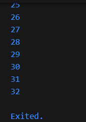
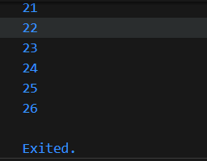
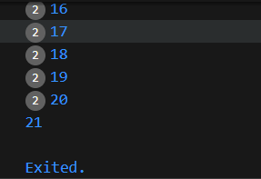
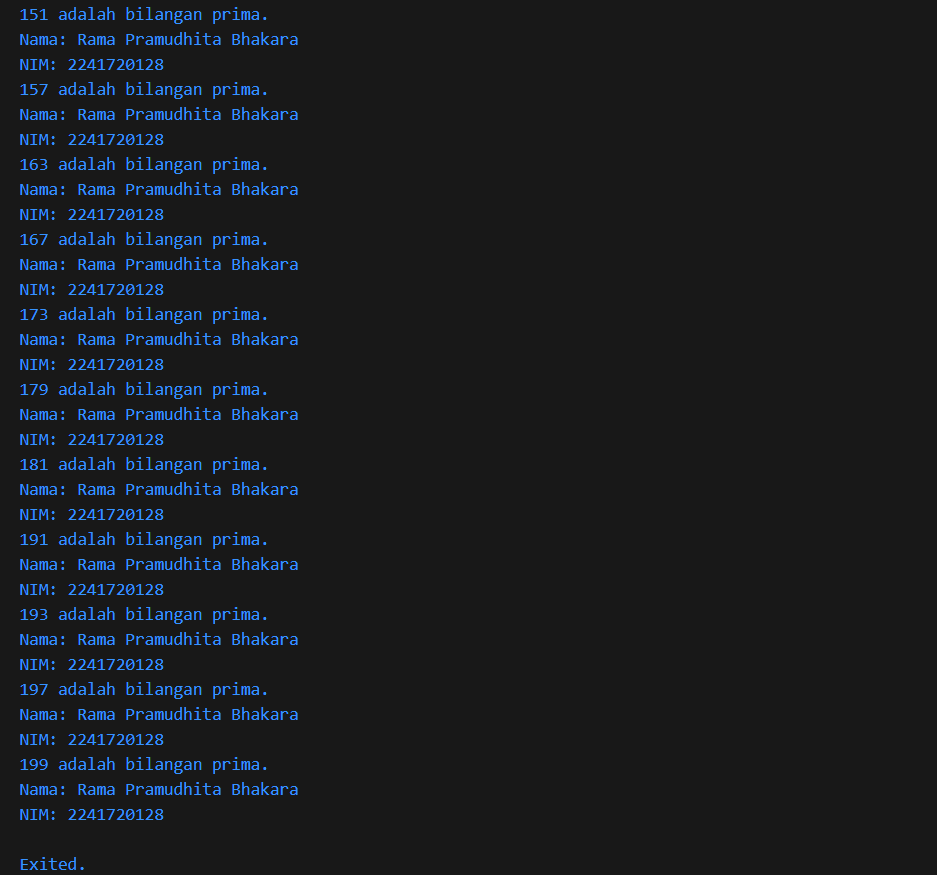

# Praktikum 1 - Menerapkan Control Flows ("if/else")
## Langkah 1
Ketik atau salin kode program berikut ke dalam fungsi ```main()```.
```String test = "test2";
if (test == "test1") {
   print("Test1");
} else If (test == "test2") {
   print("Test2");
} Else {
   print("Something else");
}

if (test == "test2") print("Test2 again");
```
## Langkah 2
Silakan coba eksekusi (Run) kode pada langkah 1 tersebut. Apa yang terjadi? Jelaskan!

> Akan terjadi error. Hal ini dikarenakan Dart bersifat case-sensitive, jadi huruf besar dan kecil dibedakan. Kesalahan ada pada penulisan If dan Else yang menggunakan huruf kapital. Berikut kode program yang telah direvisi:
```
String test = "test2";
if (test == "test1") {
   print("Test1");
} else if (test == "test2") {
   print("Test2");
} else {
   print("Something else");
}

if (test == "test2") print("Test2 again");
```
Output:


## Langkah 3
Tambahkan kode program berikut, lalu coba eksekusi (Run) kode Anda.
```
String test = "true";
if (test) {
   print("Kebenaran");
}
```
Apa yang terjadi ? Jika terjadi error, silakan perbaiki namun tetap menggunakan if/else.

> Akan terjadi error. Hal ini terjadi karena variable ```test``` dideklarasikan dua kali, yang mengharuskan kita mengubah nama variabelnya. Lalu kesalahan kedua adalah pada kondisi if tidak ada pembandingnya. Berikut kode program yang telah direvisi:
```
String test2 = "true";
  if (test2 == "true") {
    print("Kebenaran");
  }
```
Output:


# Praktikum 2 - Menerapkan Perulangan "while" dan "do-while"
## Langkah 1
Ketik atau salin kode program berikut ke dalam fungsi ```main()```.
```
while (counter < 33) {
  print(counter);
  counter++;
}
```
## Langkah 2
Silakan coba eksekusi (Run) kode pada langkah 1 tersebut. Apa yang terjadi? Jelaskan! Lalu perbaiki jika terjadi error.
> Akan terjadi error. Hal ini terjadi karena counter belum dideklarasikan variabel nya. Untuk memperbaikinya tinggal kita deklarasikan dan menginisialisasikan nilai variabel counter nya terlebih dahulu. Berikut kode program yang telah direvisi:
```
void main() {
  int counter = 0;
  while (counter < 33) {
    print(counter);
    counter++;
  }
}
```
Output:


## Langkah 3
Tambahkan kode program berikut, lalu coba eksekusi (Run) kode Anda.
```
do {
  print(counter);
  counter++;
} while (counter < 77);
```
Apa yang terjadi ? Jika terjadi error, silakan perbaiki namun tetap menggunakan do-while.
> Tidak ada error.
# Praktikum 3 - Menerapkan Perulangan "for" dan "break-continue"
## Langkah 1
Ketik atau salin kode program berikut ke dalam fungsi main().
```
for (Index = 10; index < 27; index) {
  print(Index);
}
```
## Langkah 2
Silakan coba eksekusi (Run) kode pada langkah 1 tersebut. Apa yang terjadi? Jelaskan! Lalu perbaiki jika terjadi error.
> Akan terjadi error. Hal ini terjadi karena variabel index belum dideklarasikan dan, nama variabel tidak konsisten, dan juga tidak ada increment operation. Berikut kode program setelah diperbaiki:
```
for (int index = 10; index < 27; index++) {
    print(index);
}
```
Output:


## Langkah 3
Tambahkan kode program berikut di dalam for-loop, lalu coba eksekusi (Run) kode Anda.
```
If (Index == 21) break;
Else If (index > 1 || index < 7) continue;
print(index);
```
Apa yang terjadi ? Jika terjadi error, silakan perbaiki namun tetap menggunakan for dan break-continue.
> Akan terjadi error. Hal ini terjadi karena ada beberapa kesalahan. Pertama sintaks if else harus menggunakan lowercase. Kedua kondisi ```index > 1 || index < 7``` nilainya akan selalu true. Jika kita ingin mengecheck apakah nilai ```index``` di antara 1 dan 7, harusnya menggunakan ```index > 1 && index < 7```. Berikut kode program yang telah diperbaiki:
```
void main() {
  for (int index = 10; index < 27; index++) {
    print(index);
    if (index == 21) break;
    else if (index > 1 && index < 7) continue;
    print(index);
  }
}
```
Output:


# Tugas Praktikum
1. Silakan selesaikan Praktikum 1 sampai 3, lalu dokumentasikan berupa screenshot hasil pekerjaan beserta penjelasannya!
2. Buatlah sebuah program yang dapat menampilkan bilangan prima dari angka 0 sampai 201 menggunakan Dart. Ketika bilangan prima ditemukan, maka tampilkan nama lengkap dan NIM Anda.
3. Kumpulkan berupa link commit repo GitHub pada tautan yang telah disediakan di grup Telegram!

Kode:
```
void main() {
  String nama = "Rama Pramudhita Bhakara";
  String nim = "2241720128";

  for (int num = 0; num <= 201; num++) {
    if (isPrime(num)) {
      print("$num adalah bilangan prima.");
      print("Nama: $nama");
      print("NIM: $nim");
    }
  }
}

bool isPrime(int num) {
  if (num <= 1) return false;
  for (int i = 2; i <= num ~/ 2; i++) {
    if (num % i == 0) return false;
  }
  return true;
}
```
Output:

