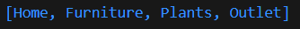
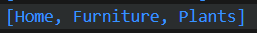

# Praktikum 1 - Eksperimen Tipe Data List
## Langkah 1
Ketik atau salin kode program berikut ke dalam ```void``` ```main()```.
```
void main() {
  var list = [1, 2, 3];
  assert(list.length == 3);
  assert(list[1] == 2);
  print(list.length);
  print(list[1]);

  list[1] = 1;
  assert(list[1] == 1);
  print(list[1]);
}
```
## Langkah 2
Silakan coba eksekusi (Run) kode pada langkah 1 tersebut. Apa yang terjadi? Jelaskan!

Kode Dart tersebut mendemonstrasikan cara kerja list dan assert dalam bahasa pemrograman Dart. Berikut penjelasan cara kerja kode tersebut:

1. ```var list = [1, 2, 3];```

Mendeklarasikan sebuah variabel list dengan nilai sebuah daftar (list) yang berisi elemen-elemen [1, 2, 3].

2. ```assert(list.length == 3);```

Menggunakan assert untuk memastikan bahwa panjang dari list (list.length) adalah 3. Jika kondisinya salah (panjang list bukan 3), program akan melempar pengecualian (error) dan berhenti.

3. ```assert(list[1] == 2);```

Assert kedua memeriksa apakah elemen di indeks 1 pada list adalah 2. Dalam Dart, indeks dimulai dari 0, jadi list[1] merujuk pada elemen kedua dalam list, yaitu 2. Jika kondisinya tidak benar, program akan error.

4. ```print(list.length);```

Mencetak panjang list, yaitu 3.

5. ```print(list[1]);```

Mencetak elemen pada indeks 1, yaitu 2.

6. ```list[1] = 1;```

Mengubah nilai elemen pada indeks 1 dari 2 menjadi 1.

7. ```assert(list[1] == 1);```

Memastikan bahwa setelah perubahan, elemen di indeks 1 pada list adalah 1.

8. ```print(list[1]);```

Mencetak elemen pada indeks 1 yang sekarang sudah berubah menjadi 1.

## Langkah 3
Ubah kode pada langkah 1 menjadi variabel final yang mempunyai index = 5 dengan default value = null. Isilah nama dan NIM Anda pada elemen index ke-1 dan ke-2. Lalu print dan capture hasilnya.

```
void main() {
  final List<dynamic> list = List.filled(5, null);  
  list[1] = 'Rama Pramudhita Bhaskara';  
  list[2] = '2241720128';   

  print(list); 
  print('Elemen index ke-1: ${list[1]}'); 
  print('Elemen index ke-2: ${list[2]}'); 
}
```

# Praktikum 2 - Eksperimen Tipe Data Set
## Langkah 1
Ketik atau salin kode program berikut ke dalam fungsi ```main()```.
```
var halogens = {'fluorine', 'chlorine', 'bromine', 'iodine', 'astatine'};
print(halogens);
```
## Langkah 2
Silakan coba eksekusi (Run) kode pada langkah 1 tersebut. Apa yang terjadi? Jelaskan! Lalu perbaiki jika terjadi error.
> Output akan menunjukkan isi dari variabel halogens

## Langkah 3
Tambahkan kode program berikut, lalu coba eksekusi (Run) kode Anda.
```
var names1 = <String>{};
Set<String> names2 = {}; // This works, too.
var names3 = {}; // Creates a map, not a set.

print(names1);
print(names2);
print(names3);
```
Apa yang terjadi ? Jika terjadi error, silakan perbaiki namun tetap menggunakan ketiga variabel tersebut. Tambahkan elemen nama dan NIM Anda pada kedua variabel Set tersebut dengan dua fungsi berbeda yaitu ```.add()``` dan ```.addAll()```. Untuk variabel Map dihapus, nanti kita coba di praktikum selanjutnya.

Revisi kode:
```
void main() {
  var halogens = {'fluorine', 'chlorine', 'bromine', 'iodine', 'astatine'};
  print(halogens);

  var names1 = <String>{};
  Set<String> names2 = {};

  names1.add('Rama Pramudhita Bhaskara'); 
  names2.addAll(['Rama Pramudhita Bhaskara', '2241720128']);

  print(names1);
  print(names2);
}
```
Output:


# Praktikum 3 - Eksperimen Tipe Data Maps
## Langkah 1
Ketik atau salin kode program berikut ke dalam fungsi main().
```
var gifts = {
  // Key:    Value
  'first': 'partridge',
  'second': 'turtledoves',
  'fifth': 1
};

var nobleGases = {
  2: 'helium',
  10: 'neon',
  18: 2,
};

print(gifts);
print(nobleGases);
```
## Langkah 2
Silakan coba eksekusi (Run) kode pada langkah 1 tersebut. Apa yang terjadi? Jelaskan! Lalu perbaiki jika terjadi error.

> Dalam Dart, maps adalah koleksi pasangan key-value.gifts dan nobleGases adalah dua map yang didefinisikan.
> gifts memiliki key bertipe String dan value bertipe campuran (String dan int).
> nobleGases memiliki key bertipe int dan value yang juga bisa berupa String dan int.
## Langkah 3
Tambahkan kode program berikut, lalu coba eksekusi (Run) kode Anda.
```
var mhs1 = Map<String, String>();
gifts['first'] = 'partridge';
gifts['second'] = 'turtledoves';
gifts['fifth'] = 'golden rings';

var mhs2 = Map<int, String>();
nobleGases[2] = 'helium';
nobleGases[10] = 'neon';
nobleGases[18] = 'argon';
```
Apa yang terjadi ? Jika terjadi error, silakan perbaiki.

Tambahkan elemen nama dan NIM Anda pada tiap variabel di atas (gifts, nobleGases, mhs1, dan mhs2). Dokumentasikan hasilnya dan buat laporannya!

Revisi kode:
```
void main() {
  var gifts = {
    // Key:    Value
    'first': 'partridge',
    'second': 'turtledoves',
    'fifth': 1
  };

  var nobleGases = {
    2: 'helium',
    10: 'neon',
    18: 2,
  };

  // print(gifts);
  // print(nobleGases);

  var mhs1 = Map<String, String>();
  gifts['first'] = 'partridge';
  gifts['second'] = 'turtledoves';
  gifts['fifth'] = 'golden rings';

  var mhs2 = Map<int, String>();
  nobleGases[2] = 'helium';
  nobleGases[10] = 'neon';
  nobleGases[18] = 'argon';

  // Menambahkan elemen nama dan NIM
  mhs1['nama'] = 'Rama Pramduhita Bhaskara'; // Contoh nama
  mhs1['nim'] = '2241720128'; // Contoh NIM
  mhs2[1] = 'Rama Pramduhita Bhaskara'; // Contoh nama untuk mhs2
  mhs2[2] = '2241720128'; // Contoh NIM untuk mhs2

  print(gifts);
  print(nobleGases);
  print(mhs1);
  print(mhs2);
}
```
Output:


# Praktikum 4 - Eksperimen Tipe Data List: Spread dan Control-flow Operators
## Langkah 1
Ketik atau salin kode program berikut ke dalam fungsi ```main()```.
```
var list = [1, 2, 3];
var list2 = [0, ...list];
print(list1);
print(list2);
print(list2.length);
```
## Langkah 2
Silakan coba eksekusi (Run) kode pada langkah 1 tersebut. Apa yang terjadi? Jelaskan! Lalu perbaiki jika terjadi error.
> Akan terjadi error dikarenakan tidak ada variable yang bernama ```list1```.
> Ketika kode sudah diperbaiki, output akan menampilkan elemen dari variable list, list2, dan panjang dari variable list2

Revisi kode:
```
void main() {
  var list = [1, 2, 3];
  var list2 = [0, ...list];
  print(list);
  print(list2);
  print(list2.length);
}
```
Output:


## Langkah 3
Tambahkan kode program berikut, lalu coba eksekusi (Run) kode Anda.
```
list1 = [1, 2, null];
print(list1);
var list3 = [0, ...?list1];
print(list3.length);
```
Apa yang terjadi ? Jika terjadi error, silakan perbaiki.
> Yang terjadi adalah adanya variable ```list1``` yang dideklarasikan dengan tiga elemen: 1, 2, dan null
> 
> Spread Operator dengan Null-aware:
Kode var list3 = [0, ...?list1]; menggunakan operator null-aware ...?, yang berarti jika list1 tidak null, elemen-elemen dari list1 akan ditambahkan ke list3.
Jika list1 adalah null, maka list3 hanya akan berisi 0.

Tambahkan variabel list berisi NIM Anda menggunakan Spread Operators. Dokumentasikan hasilnya dan buat laporannya!

Revisi kode:
```
void main() {
  var list = [1, 2, 3];
  var list2 = [0, ...list];
  
  print(list);         // Memperbaiki dari list1 menjadi list
  print(list2);
  print(list2.length);

  // Menambahkan kode berikut
  var list1 = [1, 2, null];
  print(list1);
  var list3 = [0, ...?list1];
  print(list3.length);

  // Menambahkan NIM menggunakan Spread Operator
  var nim = [2241720128];
  var list4 = [...list, ...nim]; // Menggabungkan list dengan NIM
  print(list4);
}
```
Output:


## Langkah 4
Tambahkan kode program berikut, lalu coba eksekusi (Run) kode Anda.
```
var nav = ['Home', 'Furniture', 'Plants', if (promoActive) 'Outlet'];
print(nav);
```
Apa yang terjadi ? Jika terjadi error, silakan perbaiki. Tunjukkan hasilnya jika variabel promoActive ketika ```true``` dan ```false```.

Revisi kode:
```
bool promoActive = true; 
  var nav = ['Home', 'Furniture', 'Plants', if (promoActive) 'Outlet'];
  print(nav);
```
Output true:



Output false:



## Langkah 5
Tambahkan kode program berikut, lalu coba eksekusi (Run) kode Anda.
```
var nav2 = ['Home', 'Furniture', 'Plants', if (login case 'Manager') 'Inventory'];
print(nav2);
```
Apa yang terjadi ? Jika terjadi error, silakan perbaiki. Tunjukkan hasilnya jika variabel login mempunyai kondisi lain.
> Error karena tidak ada variable login

Revisi kode:
```
var login = 'Manager';
  var nav2 = ['Home', 'Furniture', 'Plants', if (login case 'Manager') 'Inventory'];
  print(nav2);
```
Output login Manager:


Output login lain:


## Langkah 6
Tambahkan kode program berikut, lalu coba eksekusi (Run) kode Anda.
```
var listOfInts = [1, 2, 3];
var listOfStrings = ['#0', for (var i in listOfInts) '#$i'];
assert(listOfStrings[1] == '#1');
print(listOfStrings);
```
Apa yang terjadi ? Jika terjadi error, silakan perbaiki. Jelaskan manfaat Collection For dan dokumentasikan hasilnya.

> Apa yang Terjadi?
1. List ```lis1tOfInts```: Dideklarasikan dengan tiga elemen: ```1```, `2`, dan `3`.

2. List ```listOfStrings```: Menggunakan for-loop untuk membuat string baru dari setiap elemen dalam ```listOfInts```.
* ```'#$i'``` akan menghasilkan string dengan format ```#1```, ```#2```, dan `#3`.
* Jadi ```listOfStrings``` akan berisi: ```['#0', '#1', '#2', '#3']```.

3. Assert Statement: ```assert(listOfStrings[1] == '#1');``` memeriksa apakah elemen kedua dari `listOfStrings` benar-benar adalah `'#1'`. Jika tidak, maka akan terjadi error.
> Collection For adalah fitur yang sangat berguna dalam Dart yang membantu kita menulis kode yang lebih bersih, efisien, dan fleksibel saat bekerja dengan koleksi. Penggunaannya dapat meningkatkan produktivitas dan mengurangi kemungkinan kesalahan dalam pengolahan data.
# Praktikum 5 - Eksperimen Tipe Data Records
# Tugas Praktikum